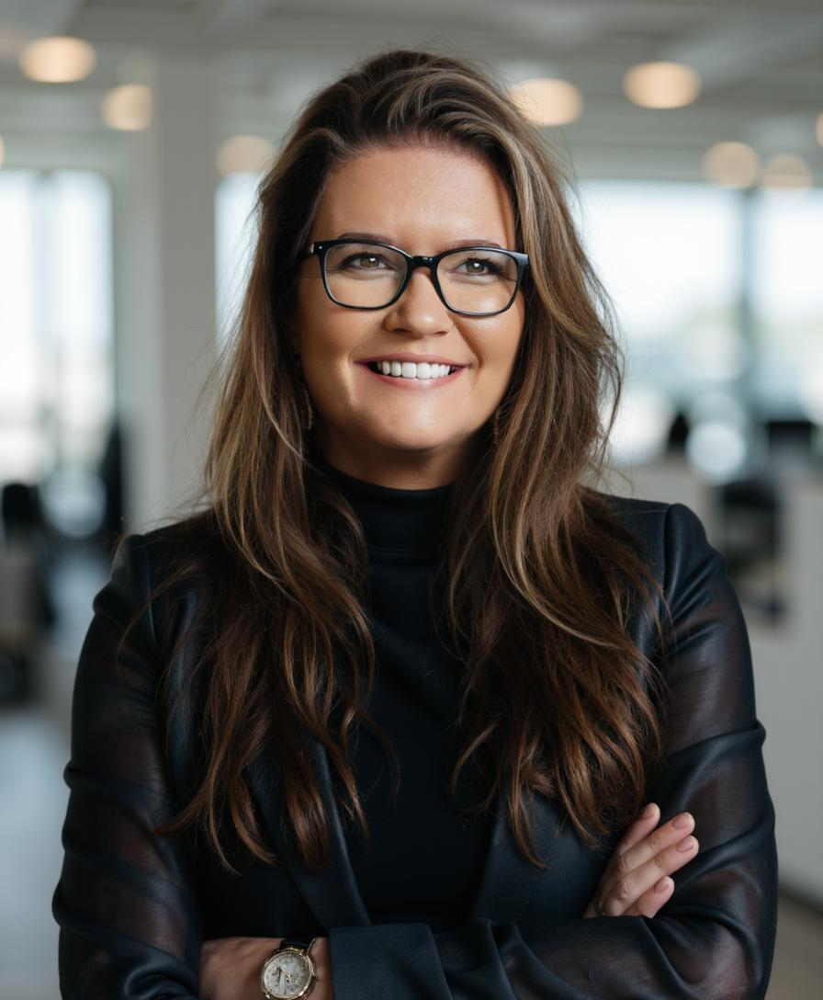
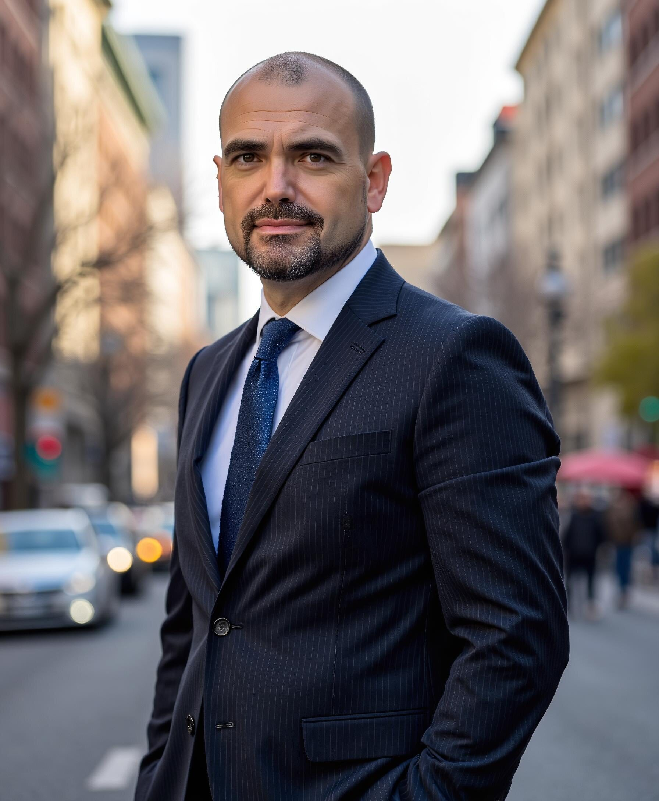
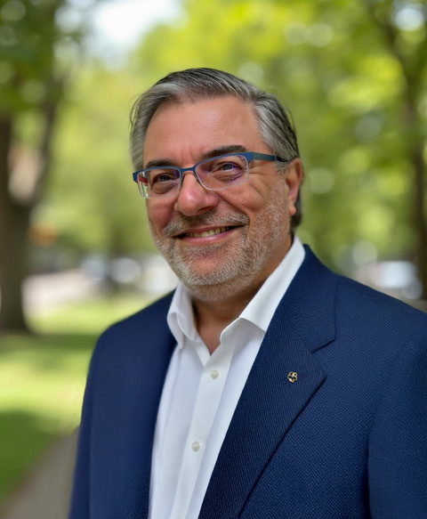
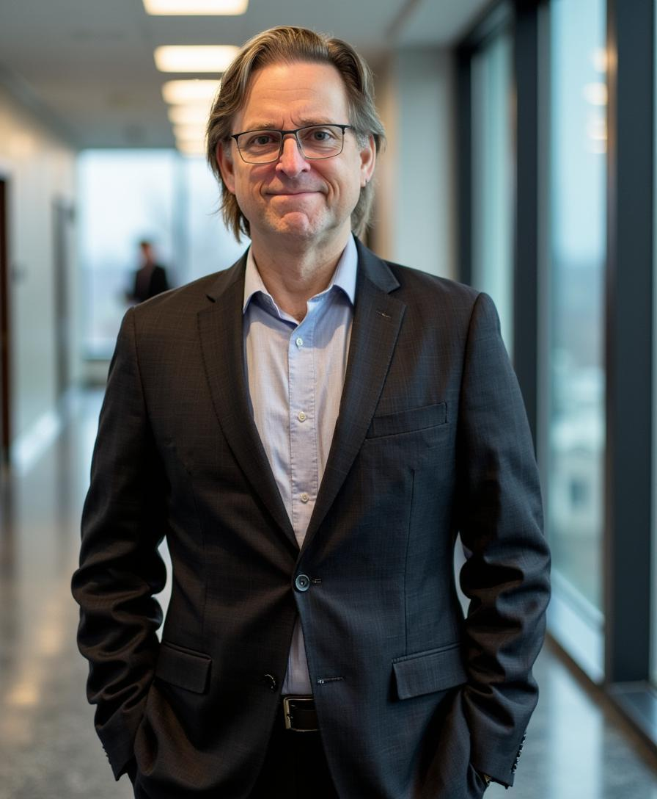
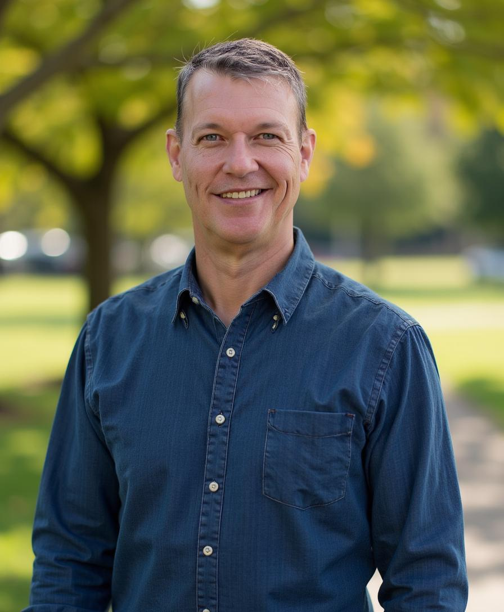
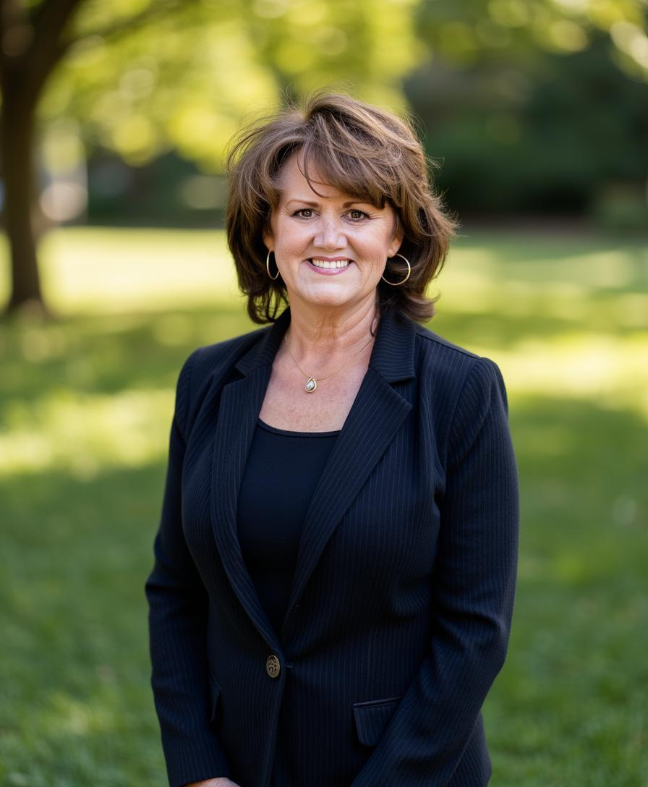

Executive Summary
ThisWay Global as Project Architect for Sovereign AI / HPC Data Centers

[ThisWay Global, Inc.](https://www.thiswayglobal.com/)(TWG) is a Texas-based company that specializes in AI and HPC solutions for enterprises, higher education institutions and state & local governments.

TWG serves as the Project Architect for next-generation, converged Sovereign AI/High Performance Computing (HPC) data centers, designed to support multi-tenant environments operating across heterogeneous hardware infrastructures. Our role encompasses the planning, orchestration, advisory services, and operational management frameworks necessary to build and sustain world-class AI and advanced computing facilities. In turn, these facilities serve governments, enterprises, research institutions, and emerging technology developers.

At the core of this architecture is the concept of an R1-class Sovereign AI facility, a regional AI and HPC hub developed through strategic partnership with a major state university. This model creates a powerful ecosystem that integrates academic research, public-sector priorities, and commercial innovation within a secure, *sovereign* computing infrastructure.

As Project Architect, TWG coordinates the design and deployment of infrastructure that supports heterogeneous compute environments, including GPUs, CPUs, AI accelerators, and specialized HPC systems from multiple vendors. This vendor-agnostic architecture enables tenants to deploy the optimal hardware stack for their workloads while maintaining interoperability and operational efficiency within the shared facility.

A key differentiator of the TWG approach is the integration of our proprietary software platform, [*Amalgamy.ai*](http://Amalgamy.ai)*.* Acting as a top-level workload and workflow scheduler, *Amalgamy.ai* optimizes the allocation of compute resources across the heterogeneous infrastructure. The platform intelligently orchestrates workloads, balances resource utilization, and maximizes efficiency for both data center operators and tenant organizations, while maintaining top tier compliance and security.

By dynamically optimizing compute scheduling and workflow management, Amalgamy.ai enables higher utilization rates, reduced operational costs, and improved performance for AI and HPC workloads.

The R1 university partnership model provides the following benefits for all stakeholders:

- State Universities gain access to cutting-edge AI and HPC infrastructure to support advanced research, attract faculty and students, and foster innovation ecosystems.

- Government and Public Sector Partners benefit from sovereign computing capabilities that strengthen regional and statewide technological independence, security, and economic development.

- Enterprise and Startup Tenants gain scalable access to high-performance infrastructure without the capital burden of building dedicated facilities.

- Operators and Infrastructure Partners benefit from optimized resource utilization and operational efficiency driven by Amalgamy.ai and ThisWay Global's architectural expertise.

Through the R1 Sovereign AI Data Center model, ThisWay Global is building the foundation for a new generation of collaborative, high-performance computing ecosystems that unite academia, government, and industry to power the AI economy.

## ThisWay Global's Leadership Team

| Photo | Name | Title | Background |
|:-----:|------|-------|------------|
|  | **Angela Hood** | Founder & Executive Chairperson | Founder of ThisWay Global; Texas A&M Outstanding Alumni. Recognized on Forbes' 50 Over 50 and Inc. Magazine's Most Innovative Founders (2024). Led TWG through the Google Accelerator program (2021) and built strategic partnerships with NVIDIA, AWS, TD Synnex, Microsoft, and IBM. |
|  | **Stephan Fabel** | Chief Executive Officer | 30+ years in the technology industry with a background in computer engineering, robotics, and cloud AI infrastructure. Previously held senior leadership roles at NVIDIA and other leading Silicon Valley companies. Career spans both Europe and the United States since 1998. |
|  | **Alex Shmelev** | CIIO and CTO (Chief Innovation and Technology Officer) | Leads AI, ML, and data integration development at TWG. 40+ years of experience with multiple patents in secure data transmission and big data analytics. Previously held roles at NerdWallet, CORT/Berkshire Hathaway, and Drugstore.com. Winner of SHRM's Innovative Technology Award and the Smithsonian Software Technology Award. |
|  | **Christian Kennedy** | Distinguished AI/HPC Architect | Four decades of experience in software systems across machine intelligence, FinTech, agriculture, energy, and biotech. Expertise in trusted systems and regulatory frameworks (GDPR, CCPA, ISO). Pioneered the first distributed OS to undergo B2-level evaluation and the first relational database evaluated at B1 level. |
|  | **Craig Peters** | Chief Product Officer | Extensive experience in cloud computing, open source software, and product development. Drives Amalgamy.ai's product vision and market strategy. Specializes in bridging technical capabilities with customer needs to shape the future of AI/HPC orchestration. |
|  | **Justin Hood** | Chief Operating Officer | Former USMC Lt Colonel and F/A-18 fighter pilot. B.S. in Construction Science from Texas A&M. Managed US Air Force combat training operations across Europe. Oversees Legal, Compliance, HR, and Finance at TWG. Held top secret security clearance with the US Department of Defense. |
|  | **Lisa Rawls** | Chief Financial Officer | 35+ years of experience in commercial banking, executive management, and financial consulting. Founder of Evergreen CFO. Georgia Tech Industrial Management graduate. Specializes in cash flow management, strategic planning, risk management, and M&A advisory. |
